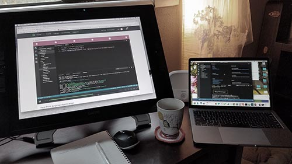
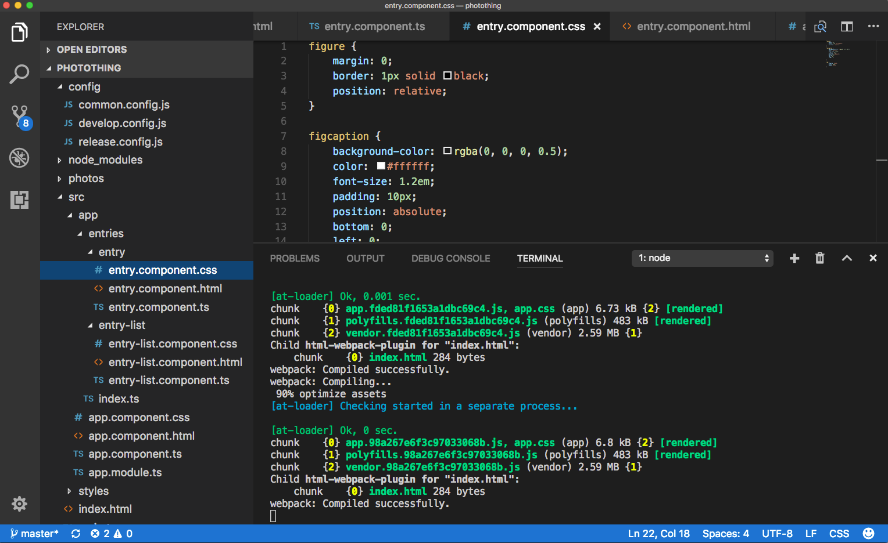
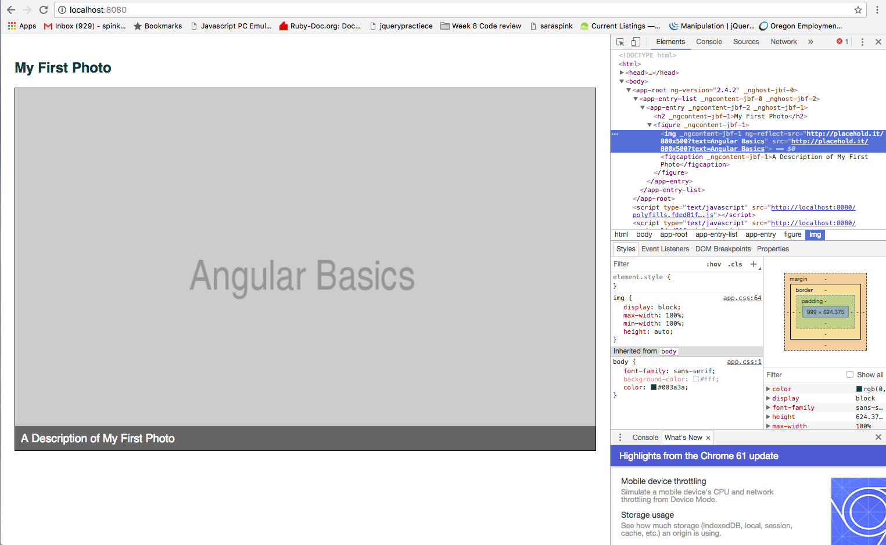

### Friday Reflections
#### 3 November, 2017
#### By Sara Spink
*************

### Hello? World?
Coding bootcamp has been a challenging journey for me. I came in feeling enthusiastic about code. Every time something rendered correctly in a browser or accepted user input I felt a wave of excitement. I made that! I defined a variable! IT WORKS AND I UNDERSTAND WHY! It's a wonderful feeling I hope most of us have had a chance to experience at the start of our coding journey.

About two months into Epicodus's full-time web development bootcamp (Ruby/JavaScript/Rails) I crashed _hard_ into a wall of self-doubt and existential anxiety.

_Rationally I know that:_
- Not being at the same level as the top students in my class does not mean I will never get a job
- If I do not fully understand a concept today I will eventually understand it with continued study
- Learning something new does not mean I have _given up_ on the creative work I have done up to this point

When I reflect on my experience thus far I can identify a great deal of progress. I came into Epicodus with very little knowledge of web development. Suddenly I can look at a page of code and understand what's going on there. I can recognize different languages. I create projects in basic Ruby, JavaScript, Angular, HTML, and CSS. If I _don't_ know what to do next, I know how to seek and use resources to find the information I need.

### A Day in the Life
I wanted to spend today focusing on forward momentum. What are my next steps in the Epicodus program? How about afterwards? Rather than being anxious about the future, what things need to be in place for me to meet my goals (and by the way, what are my goals?)

### areas I want to improve:
    - Coding syntax / understanding of core concepts
    - Ability to articulate myself about my code
    - Patience (with the process and with myself)
    - Focus

### priorities:
    - Clarify my direction. What do I want to do with this knowledge?
    - Figure out what I want to build
    - Figure out what tools/skills I will need

**********

__I started the morning by reading these articles:__

A good (but slightly intimidating) one:

[About applying to jobs after attending a coding Bootcamp](https://medium.freecodecamp.org/5-key-learnings-from-the-post-bootcamp-job-search-9a07468d2331)

Thinking about having a good foundation with basic concepts:

[Yes, you should learn Vanilla JavaScript before using JS frameworks](https://snipcart.com/blog/learn-vanilla-javascript-before-using-js-frameworks)

**********

I signed up for a [Medium account](https://medium.com/@spinkbot) but wound up writing this readme instead. Once I organize my thoughts a little more I would like to begin writing some blog posts there.

********
I gathered my ideas on paper because, let's be honest, that's how I roll:

  

*******

I really wanted to complete a treehouse project I started last week to build a photoblog in Angular2. It took a little while to get this up and running at home but right away I noticed how easily I was able to get up to speed on a brand new text editor (Visual Studio Code), and how easily I could follow along, thanks to everything I have been learning at Epicodus. I like using these two curriculums side by side as one often fills in the gaps in the other for me.

I grabbed some ginger tea and got to work!

  

If you want to dig into the code a little bit, check out my progress [here on github](https://github.com/SaraSpink/photothing).

There's not a lot to show yet but this is what things look like in Visual Studio Code:

  

and in the browser:

  

I will update this repo with a link when the project is completed.
